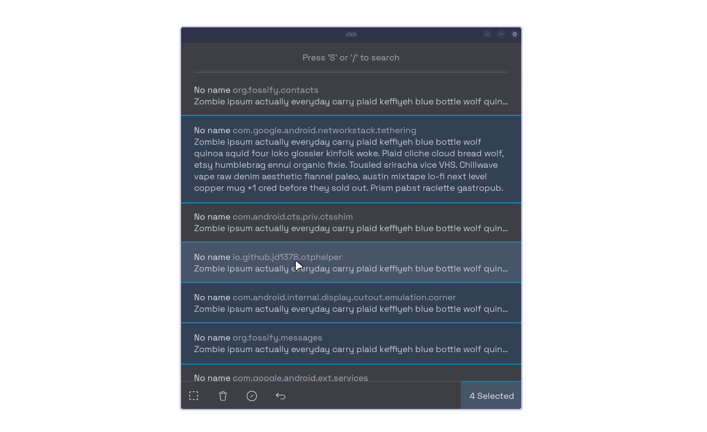

# Zilch

A vanilla tauri app to rid Android devices of software bloat.  
Keep none of 'em, none, nada, zilch.

### Features

- Simple yet powerful UI
- Intuitive keyboard shortcuts
- Extract app name by parsing apk

### TODO

- Recommendation categories
- Make uninstall and disable options depend on Android SDK

### How is this associated with Universal Android Debloater?

It is not, although I do plan to use their knowledge-base.
I have been a contributor to the original repo as well as the now maintained fork.

I started this project because of the following reasons:
- The current UI written in iced-rs is clunky due to limitations of the library.
- UAD requires you to have the ADB binary whereas we use our custom implementation of ADB written in Rust from scratch.
- I'm sick of bikeshedding. I just wanna get work done.
