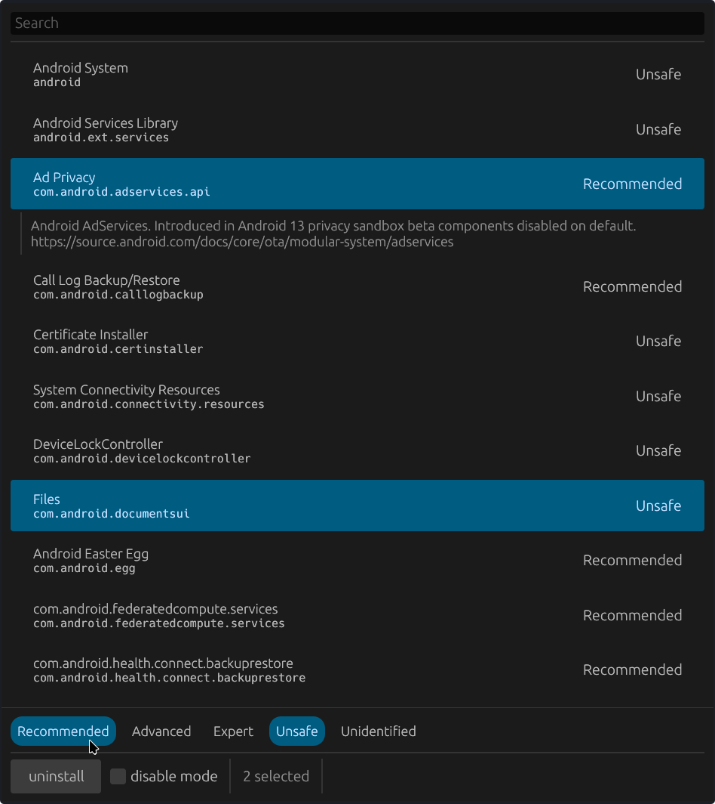

# Zilch

Purge Android bloat with confidence.



## Features

- Single compiled binary, just download and run
- No dependency on external ADB tooling
- Click on app entries to select them
- Double-click to expand
- Clear multi-selection by pressing `Escape`
- Extracts app labels via package manager API
- Architecture independent, works with any Android device over USB
- Accidentally removed apps can be restored via the revert button
- Recommendation categories (borrowed from UAD)
- Press `S` or `/` or `Ctrl` `F` to search apps
- Save the current state of packages
- Import package configuration from saves
- Uninstall and disable operations are agnostic to Android version

## Installation

### From Binary Releases

Precompiled binaries are available under the releases tab.

### Build from Source

```sh
nix develop
cargo run
```

## References

- [Gist: Backup android app, data included, no root needed, with ADB](https://gist.github.com/AnatomicJC/e773dd55ae60ab0b2d6dd2351eb977c1)
